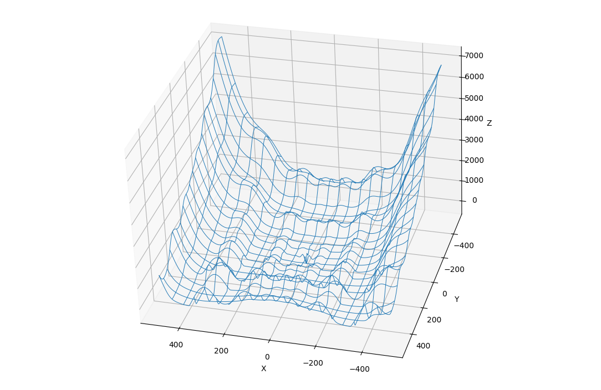

# Sobre
Este projeto tem como objetivo comparar dois algoritmos de otimização iterativos:
- Algoritmo genético
- Enxame de partículas

Para esse comparativo, foi utilizada uma função objetivo híbrida e customizada, que foi intencionalmente projetada para ser desafiadora. Ela combina as características de múltiplas funções de benchmark clássicas, como Rosenbrock, Schwefel e Ackley, resultando em uma paisagem de otimização complexa, multimodal e não-separável, ideal para testar a robustez e a capacidade de exploração dos algoritmos.

Foram feitos diferentes testes com diferentes configurações, de forma que fossem exploradas algumas particularidades de cada algoritmo. No geral, o PSO se mostrou mais apto para otimizar o mínimo global da função.

# Configurações
As diferentes configurações são:
## Excelente
- 99% das execuções retornam o valor ótimo real com ótima precisão
- Alto custo computacional
### PSO
```python
    'num_particles': 80,
    'max_iterations': 100,
    'bounds': (np.array([-500, -500]), np.array([500, 500])),
    'cognitive_coeff': 1.5,
    'social_coeff': 1.5,
    'min_w': 0.01,
    'max_w': 0.5,
    'tolerance': 1e-5,
    'patience': 10
```
### GA
```python
    'num_individuals': 80,
    'max_generations': 100,
    'bounds': (np.array([-500, -500]), np.array([500, 500])),
    'mutation_rate': 0.15,
    'mutation_strength': 10.0,
    'crossover_rate': 0.85,
    'elitism_size': 4,
    'tolerance': 1e-5,
    'patience': 10
```

## Otimizado
- 80% das vezes o ótimo é alcançado com média precisão
- Baixo custo computacional
### PSO
```python
    'num_particles': 40,
    'max_iterations': 50,
    'bounds': (np.array([-500, -500]), np.array([500, 500])),
    'cognitive_coeff': 0.5,
    'social_coeff': 0.3,
    'min_w': 0.01,
    'max_w': 0.6,
    'tolerance': 1e-3,
    'patience': 5
```
### GA
```python
    'num_individuals': 40,
    'max_generations': 65,
    'bounds': (np.array([-500, -500]), np.array([500, 500])),
    'mutation_rate': 0.07,
    'mutation_strength': 15,
    'crossover_rate': 0.7,
    'elitism_size': 10,
    'tolerance': 1e-3,
    'patience': 10
```
## Razoável
- 60% das vezes retorna o valor ótimo, precisão baixa
- Baixíssimo custo computacional comparada às outras configurações
### PSO
```python
    'num_particles': 20,
    'max_iterations': 25,
    'bounds': (np.array([-500, -500]), np.array([500, 500])),
    'cognitive_coeff': 0.5,
    'social_coeff': 0.8,
    'min_w': 0.01,
    'max_w': 0.6,
    'tolerance': 1e-1,
    'patience': 3
```
### GA
```python
    'num_individuals': 40,
    'max_generations': 50,
    'bounds': (np.array([-500, -500]), np.array([500, 500])),
    'mutation_rate': 0.5,
    'mutation_strength': 5.0,
    'crossover_rate': 0.9,
    'elitism_size': 2,
    'tolerance': 1e-1,
    'patience': 3
```

# Resultados
Ambos com configuração otimizada
### Animação do Algoritmo Genético (GA)


### Animação do Enxame de Partículas (PSO)

